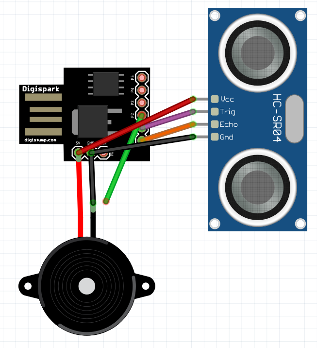

# digispark-sonar-speaker

## Hardware and software required:

-Digispark mini (ATTiny85)

-HC-SR04

## Hardware and software required:

Arduino IDE (to use this code)

## What is that:

A sample code to make beeping noise at interval when something is close to the sonar.

## Schematic:

Check out the Fritzing files (you might need the digispark mini ATTiny 85 and HC-SR04 added to your components to open it).

Or see the image:

